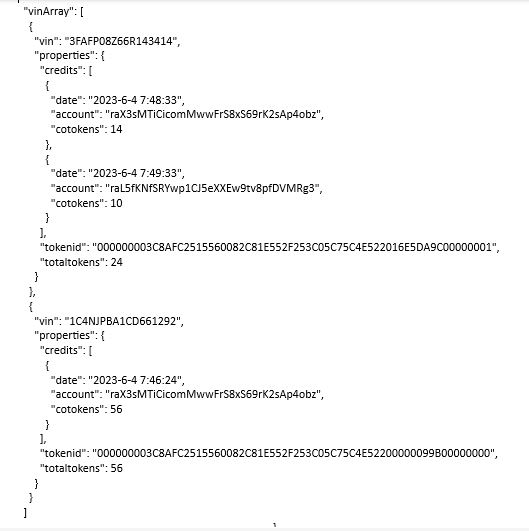
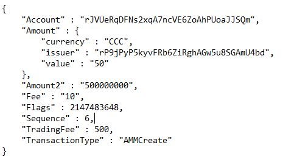

Table of Contents
1.  [What Is Carbon Credits for Cars](#what-is-carbon-credits-for-cars)
2.  [Getting Started](#getting-started)
3.  [How Carbon Credits for Cars Works](#how-carbon-credits-for-cars-works)
4.  [Next Steps](#next-steps)
5.  [Built With](#built-with)
6.  [Contact](#contact)

What is Carbon Credits for Cars
-----------------
_**Carbon Credits for Cars**_ At the intersection of stringent privacy laws and technological innovation, the automotive industry faces a timely opportunity. Many have embraced blockchain technology, often accentuating customer-centric applications to improve transparency and trust. Yet, an untapped reservoir lies dormant within a vehicle-centric approach - specifically, tokenizing Vehicle Identification Numbers (VINs) via a pivot in perspective.

By centering on vehicles, not customers, we construct a model that respects evolving privacy laws while unlocking substantive benefits. The ecosystem will gain trusted  insight into the vehicle's comprehensive carbon history, fostering informed purchases and enhancing safety. Dealers provide transparent service records, establishing trust with consumers and streamlining operations. Manufacturers glean granular insights into vehicle performance and longevity, securing and sharing valuable data that informs and transforms future production choices.

An innovative twist on the environmental, social, and governance (ESG) front, this vehicle-centric blockchain approach enables precise tracking of each vehicle's lifecycle impact. This capability could revolutionize the industry's approach to sustainability, empowering manufacturers with tools to quantify and curtail their vehicles' environmental footprint.

View the prototype web application here: [https://demos.d33gh5yazkl6vi.amplifyapp.com/]

Getting Started
---------------
The _**Carbon Credits for Cars**_ UI application has been deployed on AWS as a web service.  No
installation or configuration is required.  This web service application serves as a 
demo and is designed to be a 'sandbox' that can be used to demonstrate the functionality 
of Carbon Credits for Cars.  For demonstration purposes, the UI web page will be displayed on a browser
formatted for desktop. Ultimately the application will be deployed and formatted for mobile devices. 

*   Supported Browsers:
    *   Chrome
    *   Brave
    *   FireFox
    *   Edge

How Carbon Credits for Cars Works
--------------------
The project demo is built using React.js and consists of two primary UI elements initially: the **VIN Search screen**, 
and the **Purchase Carbon Credits screen**. https://youtu.be/Id_sJefLL5o

**VIN Search screen--**
   This is the initial UI element and allows the user to enter a VIN (vehicle identification number) and search
   for information about that VIN.  Note: in this application the user is restricted to a predefined list of
   VINs.  Ulitmately, the user will enter their VIN and the search function will retreive information from a
   publicly available API.
   *	Step 1 - Input Text Box. The user can enter/paste their VIN of interest.  All VINs are unique and require a specific format.
   	
   *	Step 2 - Search button.  If a valid VIN is entered, the search function will access the public VIN database via API and return specific information about that VIN to the UI form.
   	
   *	Step 3 - View Carbon Credits button.  Clicking this button will open the Purchase Carbon Credits screen.
   
**Purchase Carbon Credits screen--**
     This UI screen displays the total count of carbon credits that have been purchased for the selected VIN by one or multiple XRPL user accounts.  This screen also allows the user to purchase initial or additional carbon credits for the selected VIN.  Note: for demonstration purposes, a selection between two XRPL user accounts is provided.  In production, this would be replaced by connecting a wallet.
   *	Step 4 - Buy Carbon Credits button.  A user can select a purchaser account from the dropdown list and then select a quantity of carbon credits to purchase and apply to the selected VIN as tokens created specifically for this project.  A token has been issued on the XRP Ledger called 'CCC' with an initial count of 690000 tokens.
This token will represent carbon credits that have been purchased form selected carbon markets.
The Carbon Credits for Cars application will allow users to purchase these tokens and apply 
them to a specific VIN for the purpose of offsetting vehicle CO2 emmisions.
   	
**VINs Minted as NFTs--**
  When carbon credits are initially purchased for a VIN, an NFT is created on the XRP Ledger that represents
the VIN as a unique asset.  The metadata associated with the NFT is stored in a Ceramic decentralized
database with the following JSON schema.  Notice the data for 2 VINs is shown.  Each VIN has a total token count that represents 
the total number of tokens that have been purchased by one or multiple XRPL accounts.  For a VIN, 
each member of the credits array represents a purchase of ‘X’ number of tokens for a particular XRPL 
account (and the date purchased).  During the ‘purchase event’ in the UI application, this schema 
gets updated for the appropriate VIN and CCC tokens on XRPL are transferred from the issuer account 
to purchaser account.
 
 
 
 **AMM Trading Pair--**
   To allow users to easily trade their CCC tokens within the XRP Ledger, an AMM (Automated Market Maker)
function will be developed with CCC/XRP as trading pairs.  Exchange rates between the two tokens is
automatically regulated by the AMM allowing for less volatile trading.  The 'Trade' button on the Purchase Carbon Credits screen will activate another UI screen that allows users to actively trade between the two tokens.
   
   
   
Next Steps 
-------
May put some text in here that mentions that this project has great pot\ential and heres how to expand it
   *	Next step 1
   *	Next step 2
   *	Next step 3
   *	Next step 4
   *	Next step 5
   *	Next step 6

Built With
----------
*   [React](https://reactjs.org/) – JavaScript library for building user interfaces
*   [xrpl.js](https://xrpl.org/) - Javascript library for integrating dapps with the XRP Ledger,
*   XRP Ledger([https://testnet.xrpl.org](https://testnet.xrpl.org/) - testnet)
*   [Ceramic Network](https://ceramic.network/ :ceramic-clay testnet) - a decentralized data network for Web3 applications
*   [Node.js](https://nodejs.org/en/) - a cross-platform JavaScript runtime environment

Contact
-------
Jim Flint - [jim@localsearchgroup.com](mailto:blocklagoon@gmail.com)

LinkedIn - [https://www.linkedin.com/in/jimflint/]
